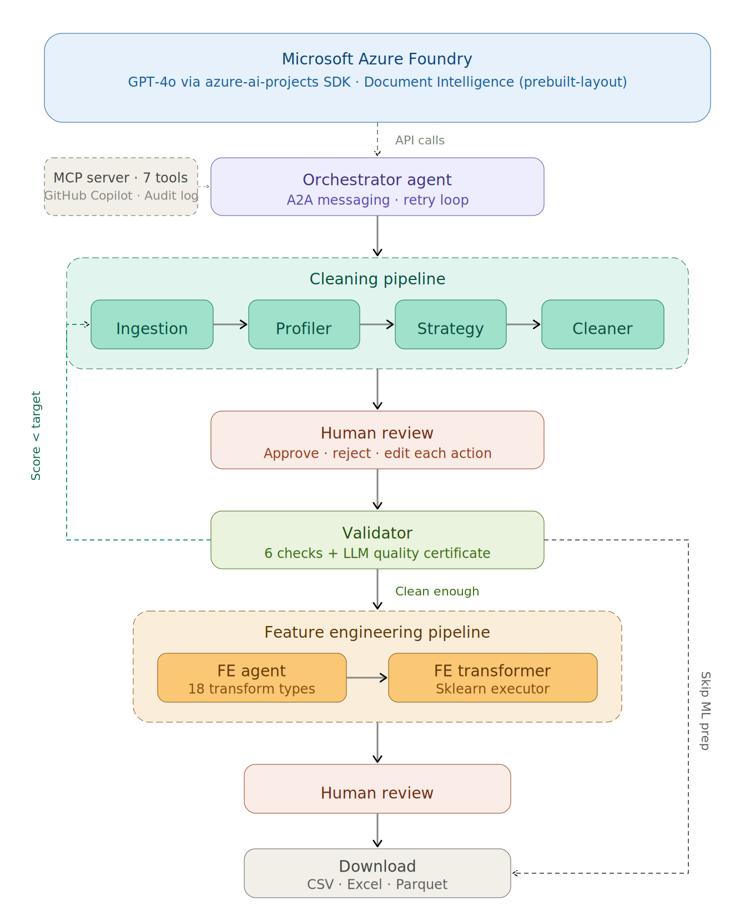
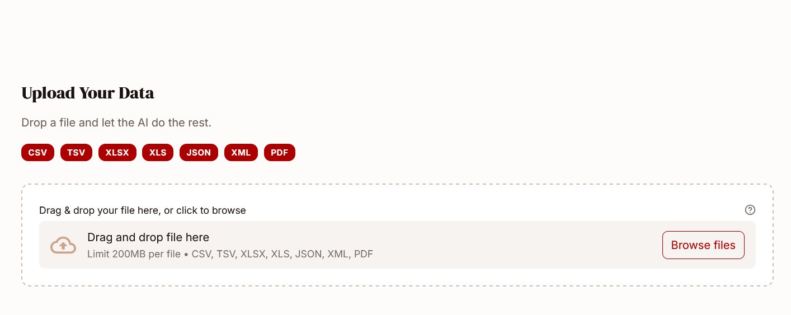
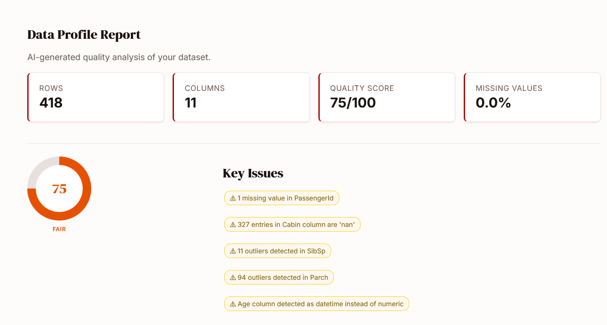
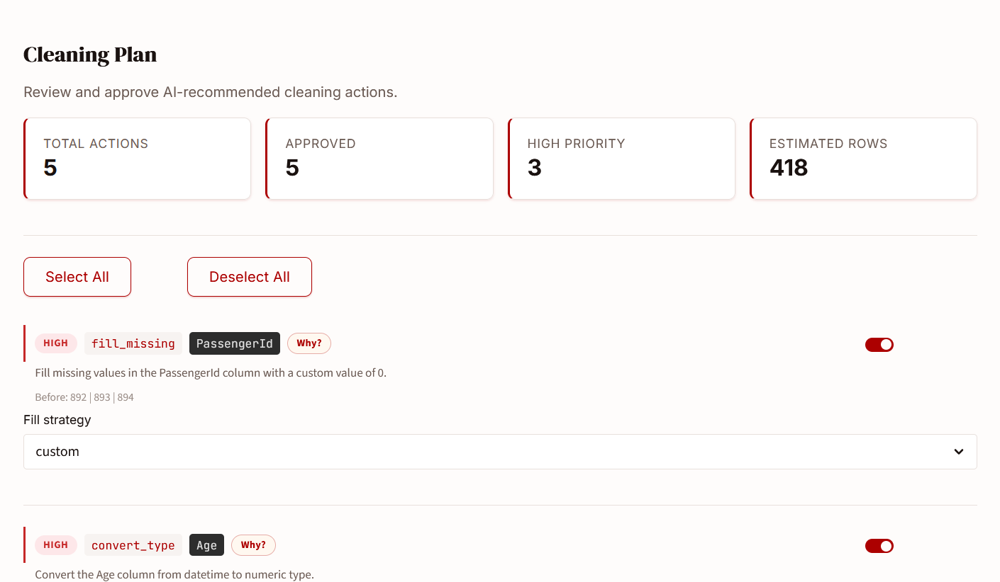
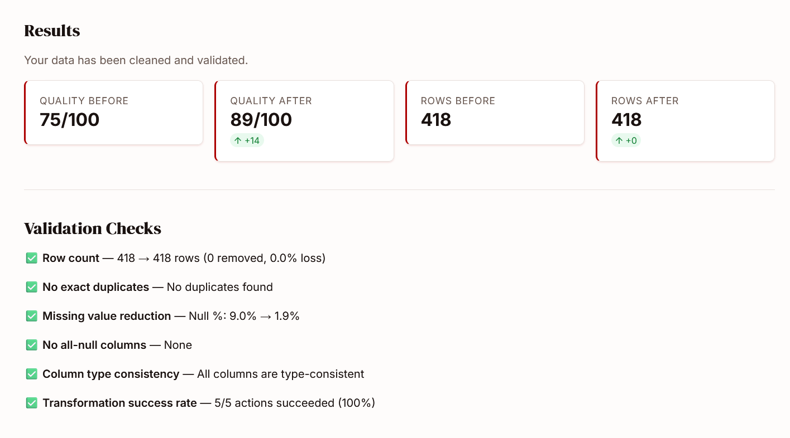
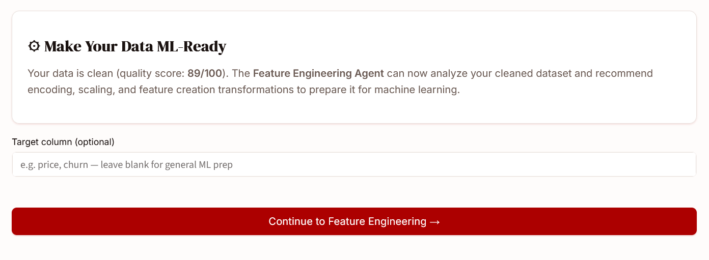
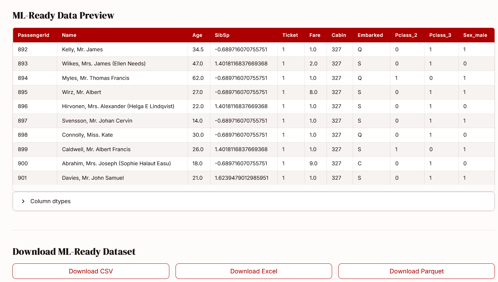

# 🧹 DataPrepAgent

**AI-Powered Data Preparation — From Messy to Analysis-Ready in Minutes**


> 🏗️ Built for the **Microsoft Purpose-Built AI Platform Hackathon**
> Category: **Best Use of Microsoft Foundry** · Also targeting: **Best Multi-Agent System** · **Best Enterprise Solution**

---


---

## How It Works in 60 Seconds

1. **Upload** any messy data file — CSV, Excel, JSON, XML, or even a PDF with tables
2. **AI profiles** every column: detects types, missing values, outliers, duplicates, and scores quality 0–100
3. **Review a cleaning plan** — approve, reject, or tweak each AI-proposed action before anything runs
4. **Optionally prepare for ML** — the AI recommends encoding, scaling, and feature transforms tailored to your data
5. **Download** your analysis-ready dataset as CSV, Excel, or Parquet

The LLM decides *what* to fix. Python executes it deterministically. Your data, your call: nothing changes without your approval.

---

## Microsoft Hero Technologies — Where & How They're Used

This section maps every required hackathon technology to the exact source files that implement it.

### ☁️ Microsoft Foundry (Azure AI Foundry)

All LLM calls in DataPrepAgent go through models hosted on Microsoft Foundry. The single LLM client in [`src/agents/__init__.py`](src/agents/__init__.py) connects to the Foundry endpoint using the `AZURE_AI_PROJECT_ENDPOINT` and `AZURE_AI_MODEL_DEPLOYMENT_NAME` environment variables. Three agents make LLM calls — the Profiler (semantic analysis), the Strategy Agent (cleaning plan generation), and the Validator (quality certificate) — plus the Feature Engineering Agent for ML recommendations. Azure Foundry's built-in content filters are active on every call.

**Key code:**
```python
# src/agents/__init__.py — AgentClient constructor
client = AIProjectClient(
    endpoint=os.getenv("AZURE_AI_PROJECT_ENDPOINT"),
    credential=AzureKeyCredential(os.getenv("AZURE_AI_PROJECT_KEY"))
)
# Creates Azure AI Agent with per-call threads
agent = client.agents.create_agent(
    model=os.getenv("AZURE_AI_MODEL_DEPLOYMENT_NAME"),
    name=self.name,
    instructions=self.instructions
)
```

### 🤖 Microsoft Agent Framework (`azure-ai-projects`)

The [`AgentClient`](src/agents/__init__.py) class uses `azure.ai.projects.AIProjectClient` as its tier-1 backend — the actual Microsoft Agent Framework SDK. It creates real Azure AI Agents with per-call threads and message-based conversations. If the SDK is unavailable (e.g., in environments without the preview package), it falls back gracefully to `openai.AzureOpenAI` pointing at the same Foundry-hosted model. Every agent in the system (Profiler, Strategy, Cleaner, Validator, Feature Engineering, Feature Transformer) uses this single client.

**Files:** [`src/agents/__init__.py`](src/agents/__init__.py) · [`src/agents/orchestrator_agent.py`](src/agents/orchestrator_agent.py) · [`src/agents/profiler_agent.py`](src/agents/profiler_agent.py) · [`src/agents/strategy_agent.py`](src/agents/strategy_agent.py) · [`src/agents/validator_agent.py`](src/agents/validator_agent.py) · [`src/agents/feature_engineering_agent.py`](src/agents/feature_engineering_agent.py) · [`src/agents/feature_transformer_agent.py`](src/agents/feature_transformer_agent.py)

### 🔌 MCP Server (7 tools)

[`src/mcp_server.py`](src/mcp_server.py) exposes the full pipeline as 7 MCP tools via stdio transport. Any MCP-compatible client — including **GitHub Copilot Agent Mode** — can call these tools programmatically. The tools are: `profile_data`, `suggest_cleaning_plan`, `clean_data`, `validate_cleaning`, `list_supported_formats`, `recommend_feature_engineering`, `apply_feature_engineering`.

### 🧑‍💻 GitHub Copilot Agent Mode

The repo includes a [`.vscode/mcp.json`](.vscode/mcp.json) configuration file that registers DataPrepAgent's MCP server as a tool source for GitHub Copilot Agent Mode in VS Code. With this config, a developer can ask Copilot: *"Profile the file test_data/messy_sales.csv and suggest a cleaning plan"* and Copilot will call the MCP tools automatically.

```json
// .vscode/mcp.json — already in the repo
{
  "servers": {
    "dataprepagent": {
      "command": "python",
      "args": ["src/mcp_server.py"],
      "env": { "AZURE_AI_PROJECT_ENDPOINT": "...", "AZURE_AI_PROJECT_KEY": "...", "AZURE_AI_MODEL_DEPLOYMENT_NAME": "gpt-4o-mini" }
    }
  }
}
```

### 📄 Azure AI Document Intelligence

[`src/parsers/pdf_parser.py`](src/parsers/pdf_parser.py) uses Azure AI Document Intelligence's `prebuilt-layout` model to extract tables from PDF files and scanned images. This is a second Azure AI service beyond the LLM, demonstrating multi-service integration on the Azure platform.

### ☁️ Azure App Service (Deployment)

[`infra/deploy.sh`](infra/deploy.sh) provides one-command deployment to Azure App Service. The script creates a resource group, App Service plan (B1 Linux), web app with Python 3.11 runtime, configures all environment variables, and deploys the code. [`startup.sh`](startup.sh) runs Streamlit on port 8000 for the Azure container. Full step-by-step instructions in [`infra/azure-deployment.md`](infra/azure-deployment.md).

---

## Architecture — 8-Agent Orchestrated Pipeline



**Agentic design patterns used:**
- **Multi-agent collaboration**: 8 specialized agents, each with a single responsibility
- **Agent-to-agent messaging**: Orchestrator sends structured `AgentMessage` objects to sub-agents
- **Orchestrator supervisor**: Central coordinator drives the pipeline, manages state, handles errors
- **Self-healing retry loop**: If quality score < target after cleaning, Orchestrator re-runs Strategy + Cleaner (up to 2 retries)
- **Human-in-the-loop checkpoints**: Pipeline pauses twice for user approval (cleaning plan + FE plan)
- **Tool-using agents**: MCP server exposes all agent capabilities as callable tools
- **Deterministic execution**: LLM reasons about *what* to do; Python code executes it. No AI-generated data values.

---

## The Problem

Data scientists spend **60–80% of their time** on data cleaning and preparation. Messy CSVs with mixed date formats, Excel exports with merged cells, nested JSON APIs with missing fields — every dataset needs hours of manual wrangling before any real analysis can begin.

## The Solution

DataPrepAgent automates the entire data preparation pipeline using **8 AI agents** orchestrated by a supervisor. Upload a messy file, get a detailed quality report, review the AI-generated cleaning plan action by action, then optionally apply ML feature engineering — all in minutes.

---

## What Makes This Different

**🧠 LLM reasons, Python executes.**
The model analyzes your data and proposes a plan. But actual transformations are deterministic pandas and scikit-learn functions. The AI never generates or modifies data values directly — no hallucinated data, no surprises.

**👤 Human-in-the-loop at every decision point.**
Both the cleaning plan and the feature engineering plan are presented as reviewable lists. Toggle each action on or off. Edit fill strategies. Change scaling methods. Nothing runs until you approve it.

**🔄 Self-healing pipeline.**
If the cleaned data still scores below the quality target, the Orchestrator Agent automatically re-runs the Strategy and Cleaner agents with refined parameters — up to 2 retry attempts.

**📋 Enterprise audit trail.**
Every pipeline run produces an append-only JSONL audit log with SHA-256 file hashes, quality scores, approved/rejected actions, LLM call counts, and backend details. No raw data is stored — only metadata.

**🔌 MCP-native.**
The full pipeline is exposed as 7 MCP tools. Connect from GitHub Copilot Agent Mode, Claude Desktop, or any MCP client and run data preparation programmatically.

---
```
## Features

- **Multi-format ingestion** — CSV, TSV, Excel (merged cells, multi-row headers), JSON (nested API flattening), XML, PDF tables (Azure Document Intelligence)
- **AI-powered profiling** — Statistical analysis enriched with LLM semantic understanding (column meaning, cross-column inconsistencies)
- **8-agent orchestrated pipeline** — Orchestrator drives sub-agents via A2A messaging with automatic retry
- **Human-in-the-loop cleaning** — Review every action before execution; edit parameters, toggle approvals
- **Deterministic transformations** — 11 cleaning action types + 18 feature engineering transforms, all backed by pandas/sklearn
- **Before/after validation** — 6 automated checks + LLM-generated quality certificate with 0–100 score
- **Feature engineering** — AI-recommended encoding (one-hot, label, ordinal, target, frequency), scaling (standard, min-max, robust, max-abs), distribution transforms (log, power, quantile), feature creation (interaction, polynomial), feature selection (low variance, high cardinality, high correlation)
- **Export** — CSV, Excel, Parquet in one click (clean data and ML-ready data)
- **Premium UI** — Custom design system with DM Serif Display, branded palette, polished components
- **Enterprise governance** — Append-only audit log, content filtering via Azure Foundry, no PII in LLM calls
```
---

## Screenshots

| Upload | Profile |
|---|---|
|  |  |

| Cleaning Plan | Results |
|---|---|
|  |  |

| Feature Engineering | Download |
|---|---|
|  |  | |

```

---

## Quick Start

```bash
git clone https://github.com/Steve-Git9/TwoShakes.git
cd TwoShakes
python -m venv .venv
source .venv/bin/activate        # Windows: .venv\Scripts\activate
pip install -r requirements.txt
cp .env.example .env             # fill in your Azure credentials
streamlit run frontend/app.py
```

Open http://localhost:8501 and upload any of the demo files in `test_data/`.

### Environment Variables

```
AZURE_AI_PROJECT_ENDPOINT=https://your-project.services.ai.azure.com
AZURE_AI_PROJECT_KEY=your-api-key
AZURE_AI_MODEL_DEPLOYMENT_NAME=gpt-4o-mini
AZURE_DOCUMENT_INTELLIGENCE_KEY=your-key
AZURE_DOCUMENT_INTELLIGENCE_ENDPOINT=https://your-resource.cognitiveservices.azure.com
```

---

## MCP Server — Use with GitHub Copilot Agent Mode

DataPrepAgent exposes its full pipeline as MCP tools, designed to work with **GitHub Copilot Agent Mode** and any MCP-compatible client.

**GitHub Copilot Agent Mode** (VS Code):
Add to your `.vscode/mcp.json`:
```json
{
  "servers": {
    "dataprepagent": {
      "command": "python",
      "args": ["src/mcp_server.py"],
      "env": {
        "AZURE_AI_PROJECT_ENDPOINT": "...",
        "AZURE_AI_PROJECT_KEY": "...",
        "AZURE_AI_MODEL_DEPLOYMENT_NAME": "gpt-4o-mini"
      }
    }
  }
}
```

Then in Copilot Agent Mode, ask: *"Profile the file test_data/messy_sales.csv and suggest a cleaning plan"* — Copilot will call the MCP tools automatically.

**Claude Desktop** (`~/claude_desktop_config.json`):
```json
{
  "mcpServers": {
    "dataprepagent": {
      "command": "python",
      "args": ["<absolute-path>/src/mcp_server.py"],
      "env": {
        "AZURE_AI_PROJECT_ENDPOINT": "...",
        "AZURE_AI_PROJECT_KEY": "...",
        "AZURE_AI_MODEL_DEPLOYMENT_NAME": "gpt-4o-mini"
      }
    }
  }
}
```

| Tool | Description |
|---|---|
| `profile_data` | Ingest a file and return a full ProfileReport JSON |
| `suggest_cleaning_plan` | Generate a CleaningPlan from a profile |
| `clean_data` | Execute the plan, return cleaned file path + log |
| `validate_cleaning` | Run 6 checks, return ValidationReport JSON |
| `list_supported_formats` | List supported file extensions |
| `recommend_feature_engineering` | AI analysis → FeatureEngineeringPlan with 18 transform types |
| `apply_feature_engineering` | Execute approved transforms → ML-ready file + log |

---

## Agent Details

### Orchestrator Agent
Supervisor that drives all sub-agents via structured A2A messages. Includes a self-healing loop: if quality score remains below target after cleaning, it sends a retry message back to the Strategy Agent and re-cleans (up to 2 attempts). Optionally triggers the feature engineering phase.

### Ingestion Agent
Routes uploaded files to the correct parser (CSV, Excel, JSON, XML, PDF), strips empty rows/columns, and returns a `FileMetadata` object.

### Profiler Agent
Two-stage analysis: (1) statistical — column types, missing rates, IQR outliers, fuzzy duplicate detection, all in Python; (2) LLM semantic enrichment via Azure Foundry — interprets column semantics, detects cross-column inconsistencies, generates a quality summary.

### Strategy Agent
Sends the `ProfileReport` + samples to the LLM with a detailed prompt. Returns an ordered `CleaningPlan` — each action has a type, parameters, priority, and human-readable reason.

### Cleaner Agent
Dispatches each approved action to deterministic pandas functions. Captures before/after samples, logs every action. Individual failures are caught and reported — the pipeline continues.

### Validator Agent
Runs 6 automated checks (row count, duplicates, null reduction, empty columns, type consistency, transform success rate) then calls the LLM for a narrative quality certificate.

### Feature Engineering Agent
Two-stage analysis: (1) statistical — skewness, kurtosis, correlation matrix, cardinality, variance; (2) LLM recommendation — selects from 18 transform types, grouped and ordered (encoding → scaling → distribution → creation → selection).

| Category | Techniques |
|---|---|
| Encoding | one-hot, label, ordinal, target (smoothed mean), frequency |
| Scaling | standard (z-score), min-max, robust (IQR), max-abs |
| Distribution | log (auto-offset), Yeo-Johnson power, quantile normalization |
| Feature Creation | interaction products, polynomial features, binning |
| Feature Selection | drop low-variance, drop high-cardinality, drop highly-correlated |

### Feature Transformer Agent
Fault-tolerant executor: dispatches each approved `FeatureEngineeringAction` to the correct sklearn-backed function. Per-action exceptions are caught and logged; the pipeline always continues.

---

## Project Structure

```
TwoShakes/
├── .vscode/mcp.json                # GitHub Copilot Agent Mode config
├── frontend/                       # Streamlit UI + custom design system
│   ├── app.py                      # Entry point, sidebar, step routing
│   ├── static/style.css            # 500-line master CSS
│   ├── pages/                      # Upload, Profile, Plan, Results, FE
│   └── components/                 # Reusable UI components
├── src/
│   ├── agents/                     # 8 agents (incl. orchestrator, FE)
│   │   └── __init__.py             # AgentClient — azure-ai-projects + fallback
│   ├── parsers/                    # CSV, Excel, JSON, XML, PDF parsers
│   │   └── pdf_parser.py           # Azure Document Intelligence
│   ├── transformations/            # 11 cleaning + 18 FE transform functions
│   ├── governance/audit_log.py     # Enterprise audit trail
│   ├── mcp_server.py              # 7 MCP tools (stdio transport)
│   └── models/schemas.py          # All Pydantic v2 data contracts
├── test_data/                      # Demo messy datasets
├── tests/                          # Unit + integration tests
├── infra/
│   ├── deploy.sh                   # Azure App Service deployment
│   └── azure-deployment.md         # Step-by-step deployment guide
├── docs/                           # Architecture docs + screenshots
├── .streamlit/config.toml          # Streamlit theme config
├── requirements.txt
├── startup.sh                      # Azure App Service startup
└── .env.example
```

---

## Responsible AI

- **Human-in-the-loop** — No data is modified without explicit user approval of each action
- **No PII in LLM calls** — Only column names, statistics, and 3–5 sample values are sent to the model
- **Transparency** — Every transformation is logged with rows affected and before/after samples
- **Content filtering** — Azure AI Foundry applies built-in content filters to all model calls
- **Deterministic execution** — The LLM proposes; Python executes. No AI-generated data values
- **Audit trail** — Append-only JSONL log with SHA-256 file hashes for governance and reproducibility

---

## Azure Deployment

See [infra/azure-deployment.md](infra/azure-deployment.md) for step-by-step instructions.

```bash
set -a && source .env && set +a
bash infra/deploy.sh
```

---

## License

MIT — see [LICENSE](LICENSE)
