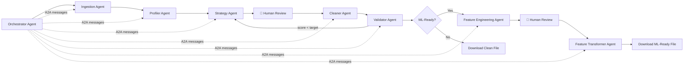

# 🧹 DataPrepAgent

**AI-Powered Data Preparation — From Messy to Analysis-Ready in Minutes**


> 🏗️ Built for the Microsoft Purpose-Built AI Platform Hackathon
> Targeting: **Best Overall** · **Best Use of Microsoft Foundry** · **Best Multi-Agent System** · **Best Enterprise Solution** · **Best Azure Integration**

---

## The Problem

Data scientists spend **60–80% of their time** on data cleaning. Messy CSVs, inconsistent Excel exports, nested JSON APIs — every dataset needs hours of manual wrangling before any analysis can begin. This is the most tedious, least valuable part of the data science workflow.

## The Solution

DataPrepAgent automates data preparation and ML feature engineering using an **8-agent AI pipeline** orchestrated by a supervisor Orchestrator Agent. Upload any messy file, get a detailed quality report, review an AI-generated cleaning plan action by action, then optionally prepare your data for machine learning — all in minutes, not hours.



---

## Hero Technologies

| Technology | Role |
|---|---|
| **Microsoft Azure AI Foundry** | Hosts GPT-4o; all 3 LLM agents call it via `AgentClient` |
| **Microsoft Agent Framework** (`azure-ai-projects`) | `AIProjectClient.agents` API — creates Azure AI Agents with per-call threads; falls back to `AzureOpenAI` if unavailable |
| **Azure AI Document Intelligence** | `prebuilt-layout` model extracts tables from PDF / scanned files |
| **MCP Server** (`src/mcp_server.py`) | Exposes the full pipeline as 5 MCP tools — callable from GitHub Copilot Agent Mode, Claude Desktop, or any MCP client |
| **Azure App Service** | One-command cloud deployment via `bash infra/deploy.sh` |

---

## Features

- **Multi-format ingestion** — CSV, TSV, Excel (merged cells/multi-row headers), JSON (nested API flattening), XML (attribute extraction), **PDF** (Azure Document Intelligence table extraction)
- **AI-powered profiling** — Statistical analysis (types, missing values, outliers, duplicates) enriched with LLM semantic understanding via Azure AI Foundry
- **Orchestrated multi-agent pipeline** — Orchestrator Agent drives all sub-agents via A2A messaging; automatically re-runs Strategy+Cleaner if quality score < target
- **Human-in-the-loop cleaning plans** — Approve or reject each proposed fix; edit fill strategies and outlier actions before executing
- **Deterministic transformations** — LLM reasons about *what* to fix; pandas/sklearn executes it. No hallucinated data.
- **Before/after validation** — 6 automated checks + LLM-generated quality certificate
- **Feature Engineering Agent** — AI-recommended ML transformations (encoding, scaling, distribution transforms, feature creation, feature selection) with human review before execution
- **MCP server** — Full pipeline (cleaning + feature engineering) accessible as 7 tools from GitHub Copilot Agent Mode and any MCP client
- **Enterprise audit log** — Append-only JSONL audit trail (no raw data, only hashes + stats) for governance and cost tracking
- **Premium UI** — Custom design system with DM Serif Display typography, brand color palette, and polished component library
- **Export to CSV / Excel / Parquet** — One-click download in your preferred format (clean data and ML-ready data)

---

## Screenshots

| Upload | Profile |
|---|---|
| *File dropzone with format badges, styled file card, st.status progress* | *CSS circular quality gauge, column type badges, per-column expanders* |

| Cleaning Plan | Results |
|---|---|
| *Priority-bordered action cards with toggles, Select All/Deselect All* | *Before/after metrics, tabbed data preview, quality certificate, downloads* |

| Feature Engineering | |
|---|---|
| *Grouped actions (Encoding / Scaling / Distribution / Creation / Selection), ML-ready download* | |

---

## MCP Server — Use with GitHub Copilot Agent Mode

DataPrepAgent exposes its full pipeline as MCP tools. Connect from any MCP client:

**Claude Desktop** (`~/claude_desktop_config.json`):
```json
{
  "mcpServers": {
    "dataprepagent": {
      "command": "python",
      "args": ["<absolute-path>/src/mcp_server.py"],
      "env": {
        "AZURE_AI_PROJECT_ENDPOINT": "...",
        "AZURE_AI_PROJECT_KEY": "...",
        "AZURE_AI_MODEL_DEPLOYMENT_NAME": "gpt-4o"
      }
    }
  }
}
```

**Available MCP Tools:**

**Cleaning Pipeline:**

| Tool | Description |
|---|---|
| `profile_data(file_path)` | Ingest a file and return a full ProfileReport JSON |
| `suggest_cleaning_plan(file_path, profile_json)` | Return a CleaningPlan JSON |
| `clean_data(file_path, plan_json)` | Execute the plan, return cleaned file path + log |
| `validate_cleaning(original, cleaned, profile, log)` | Return ValidationReport JSON |
| `list_supported_formats()` | List supported file extensions |

**Feature Engineering Pipeline:**

| Tool | Description |
|---|---|
| `recommend_feature_engineering(cleaned_path, target_column?)` | AI analysis of cleaned data → FeatureEngineeringPlan JSON with 18 transformation types |
| `apply_feature_engineering(cleaned_path, fe_plan_json)` | Execute approved transformations → ML-ready CSV + FeatureEngineeringLog JSON |

---

## Quick Start

```bash
git clone https://github.com/<user>/dataprepagent.git
cd dataprepagent
python -m venv .venv
source .venv/bin/activate        # Windows: .venv\Scripts\activate
pip install -r requirements.txt
cp .env.example .env             # fill in your Azure credentials
streamlit run frontend/app.py
```

Then open http://localhost:8501 and upload any of the demo files in `test_data/`.

---

## Project Structure

```
dataprepagent/
├── frontend/
│   ├── app.py                        # Entry point: branded sidebar, step indicator, session state
│   ├── static/
│   │   └── style.css                 # 500-line master CSS (design system, custom components)
│   ├── pages/
│   │   ├── 1_Upload.py               # Dropzone, st.status progress, format badges
│   │   ├── 2_Profile.py              # CSS quality gauge, column expanders
│   │   ├── 3_Cleaning_Plan.py        # Priority-bordered action cards + toggles
│   │   ├── 4_Results.py              # Before/after metrics, certificate, tabbed preview
│   │   └── 5_Feature_Engineering.py  # Grouped FE actions → ML-ready download
│   └── components/
│       ├── ui_helpers.py             # render_metric_card, render_quality_gauge, etc.
│       ├── file_uploader.py
│       ├── profile_cards.py
│       ├── plan_editor.py
│       └── comparison_view.py
├── src/
│   ├── agents/
│   │   ├── __init__.py               # AgentClient — single LLM wrapper
│   │   ├── ingestion_agent.py
│   │   ├── profiler_agent.py
│   │   ├── strategy_agent.py
│   │   ├── cleaner_agent.py
│   │   ├── validator_agent.py
│   │   ├── orchestrator_agent.py     # Multi-agent orchestration with optional FE phase
│   │   ├── feature_engineering_agent.py  # Two-phase FE recommendation (stats + LLM)
│   │   └── feature_transformer_agent.py  # Fault-tolerant FE execution
│   ├── parsers/
│   │   ├── __init__.py               # parse_file() dispatcher
│   │   ├── csv_parser.py
│   │   ├── excel_parser.py
│   │   ├── json_parser.py
│   │   └── xml_parser.py
│   ├── transformations/
│   │   ├── type_conversion.py
│   │   ├── missing_values.py
│   │   ├── categorical.py
│   │   ├── datetime_parser.py
│   │   ├── deduplication.py
│   │   ├── outliers.py
│   │   ├── text_cleaning.py
│   │   └── feature_engineering.py    # 18 sklearn-backed FE transformation functions
│   ├── governance/
│   │   └── audit_log.py              # Append-only JSONL audit trail (cleaning + FE)
│   ├── mcp_server.py                 # 7 MCP tools (cleaning + feature engineering)
│   └── models/
│       └── schemas.py                # All Pydantic v2 data contracts (incl. FE models)
├── .streamlit/
│   └── config.toml                   # Brand color theme (#5A2215)
├── test_data/
│   ├── messy_sales.csv
│   ├── messy_employees.xlsx
│   ├── nested_api_response.json
│   └── messy_products.xml
├── tests/
│   ├── test_full_pipeline.py         # End-to-end integration test
│   ├── test_feature_engineering.py   # 16 unit tests for FE pipeline
│   ├── test_profiler.py
│   ├── test_workflow.py
│   └── test_parsers.py
├── infra/
│   ├── deploy.sh                # Azure App Service deployment
│   └── azure-deployment.md     # Step-by-step deployment guide
├── docs/
│   └── architecture.md
├── startup.sh                   # App Service startup command
├── requirements.txt
└── .env.example
```

---

## Agent Details

### Ingestion Agent
Routes the uploaded file to the correct parser (CSV, Excel, JSON, XML), strips fully empty rows/columns, and returns a `FileMetadata` object describing the file's structure.

### Profiler Agent
Two-stage analysis:
1. **Statistical** — infers column types, computes missing rates, IQR outliers, fuzzy duplicate detection
2. **LLM semantic enrichment** (via Microsoft Foundry) — interprets column semantics, detects cross-column issues, generates a human-readable quality summary

### Strategy Agent
Sends the full `ProfileReport` + column sample values to the LLM (Foundry) with a detailed system prompt. Returns a structured `CleaningPlan` — an ordered list of `CleaningAction` objects with priorities and parameters.

### Cleaner Agent
Dispatches each *approved* action to deterministic pandas transformation functions. Captures before/after samples, logs every action, and never crashes on individual failures — errors are captured and reported, the pipeline continues.

### Validator Agent
Runs 6 automated checks (row count, duplicates, null reduction, empty columns, type consistency, transform success rate) then calls the LLM (Foundry) for a narrative quality certificate and `analysis_ready` flag.

### Feature Engineering Agent *(new)*
Two-phase analysis:
1. **Statistical** — computes skewness, kurtosis, correlation matrix, cardinality, and variance for every column
2. **LLM recommendation** (via Microsoft Foundry) — selects from 18 transformation types and orders them correctly (encoding → scaling → distribution → creation → selection)

Supported transformations:

| Category | Techniques |
|---|---|
| Encoding | one-hot, label, ordinal, target (smoothed mean), frequency |
| Scaling | standard (z-score), min-max, robust (IQR), max-abs |
| Distribution | log (auto-offset), Yeo-Johnson power, quantile normalization |
| Feature Creation | interaction products, polynomial features, equal-width binning |
| Feature Selection | drop low-variance, drop high-cardinality, drop highly-correlated |

### Feature Transformer Agent *(new)*
Fault-tolerant executor: dispatches each approved `FeatureEngineeringAction` to the correct sklearn-backed function via a `_DISPATCH` dict. Per-action exceptions are captured and logged; the pipeline always continues.

---

## Responsible AI

- **Human-in-the-loop** — No data is modified without explicit user approval of each cleaning action
- **No PII in LLM calls** — Only column names, statistics, and 3–5 sample values are sent to the model; raw data never leaves your environment
- **Transparency** — Every transformation is logged with rows affected and before/after samples
- **Content filtering** — Azure AI Foundry applies built-in content filters to all model calls
- **Deterministic execution** — The LLM proposes; Python executes. No AI-generated data values.

---

## Azure Deployment

See [infra/azure-deployment.md](infra/azure-deployment.md) for step-by-step instructions.

```bash
set -a && source .env && set +a
bash infra/deploy.sh
```

---

## Developed With

- **VS Code** + **GitHub Copilot** — development environment and AI-assisted coding
- **Microsoft Agent Framework (Python)** — agent orchestration (`azure-ai-projects`)
- **Azure AI Foundry** — GPT-4o model hosting and inference for all LLM agents
- **Azure AI Document Intelligence** — PDF table extraction (`prebuilt-layout`)
- **Streamlit** — UI framework, transformed into a premium SaaS-grade experience
- **Custom Design System** — DM Serif Display + Inter + JetBrains Mono typography; `#5A2215` brand palette; 500-line master CSS
- **scikit-learn** — All 18 ML transformation functions (scalers, encoders, transformers)
- **pandas / numpy / plotly** — data processing and visualization

---

## License

MIT — see [LICENSE](LICENSE)
